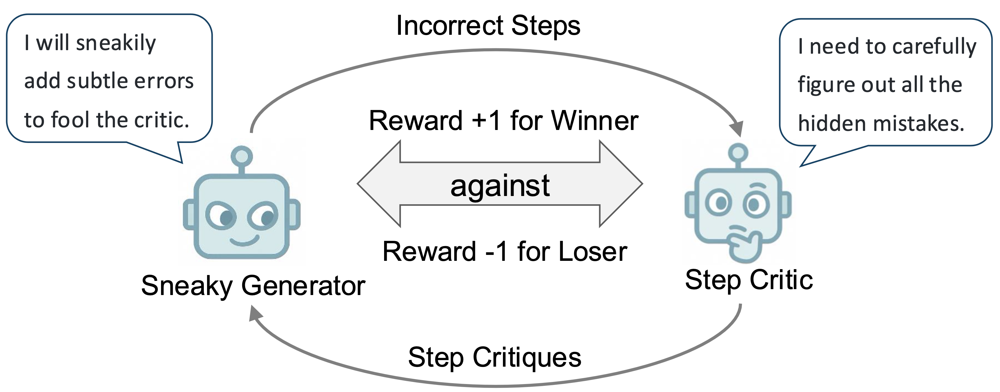

# SPC

**SPC: Evolving Self-Play Critic via Adversarial Games for LLM Reasoning**

The official implementation of SPC. [[arXiv]](https://arxiv.org/abs/2504.19162) [[Project]](https://chen-judge.github.io/SPC/) [[Hugging Face]](https://huggingface.co/judge/SPC-Critic-2/tree/main)

**Jiaqi Chen**, Bang Zhang, Ruotian Ma, Peisong Wang, Xiaodan Liang, Zhaopeng Tu, Xiaolong Li, Kwan-Yee K. Wong.

<p align="center">
  
</p>

If you have any questions, please contact me by email: [jqchen(at)cs.hku.hk](mailto:jqchen@cs.hku.hk)


## Environment 🔧

Please install these requirements:
```setup
pip install -r requirements.txt
```
For inference, please also install vllm (we use version 0.6.6).


## Data 📚
Please find our training data and evaluation dataset [here](https://connecthkuhk-my.sharepoint.com/:f:/g/personal/jadge_connect_hku_hk/EkB9OYBHr_tGmGeJ5xxTncgBXFnln9nPP4jmCKNcQSSDIQ?e=oF7b6g).

`data_round0_sft_critic.json` is SFT data and `data_round2_rl_critic.json` is for round 2 RFT.

The three files in `data/eval` correspond to the datasets used for evaluating the critic.

## Checkpoints 💼

We have uploaded the trained [SFT critic model](https://huggingface.co/judge/SPC-Critic-0/tree/main) (round 0) and [RL critic model](https://huggingface.co/judge/SPC-Critic-2/tree/main) (round 2) to Hugging Face!

## Reinforcement Finetuning 🔥
You can use the data we provided to update the SFT critic model to the round 2 critic model. 

Please modify the data and model paths in the script as needed before running it:
```RL
bash scripts/rl_critic.sh
```

## Evaluation 🚀
After obtaining a critic model, please set the paths to the dataset and the checkpoint in the following script to perform evaluation.

```eval
python3 eval/infer_batch.py
```

## Citation 🌟
<pre>
@article{chen2025spc,
  title={SPC: Evolving Self-Play Critic via Adversarial Games for LLM Reasoning},
  author={Chen, Jiaqi and Zhang, Bang and Ma, Ruotian and Wang, Peisong and Liang, Xiaodan and Tu, Zhaopeng and Li, Xiaolong and Wong, Kwan-Yee~K.},
  journal={arXiv preprint arXiv:2504.19162},
  year={2025}
}
</pre>